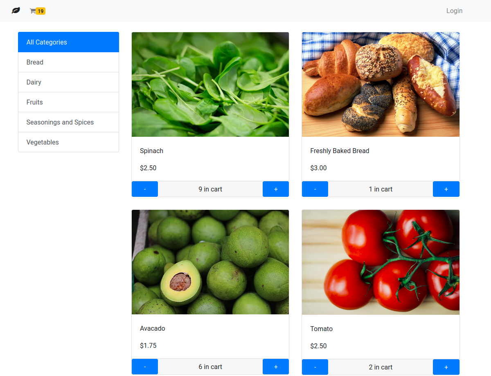

# Oshop

This project was generated with [Angular CLI](https://github.com/angular/angular-cli) version 8.3.21.



## Development server

To install dependencies, go into the project directory and run the command:

```
$ npm install
```

Run `ng serve` for a dev server. Navigate to `http://localhost:4200/`. The app will automatically reload if you change any of the source files.

## Build

Run `ng build` to build the project. The build artifacts will be stored in the `dist/` directory. Use the `--prod` flag for a production build.

## Running unit tests

Run `ng test` to execute the unit tests via [Karma](https://karma-runner.github.io).

## Running end-to-end tests

Run `ng e2e` to execute the end-to-end tests via [Protractor](http://www.protractortest.org/).

## Check the project live

https://oshop-de817.firebaseapp.com/